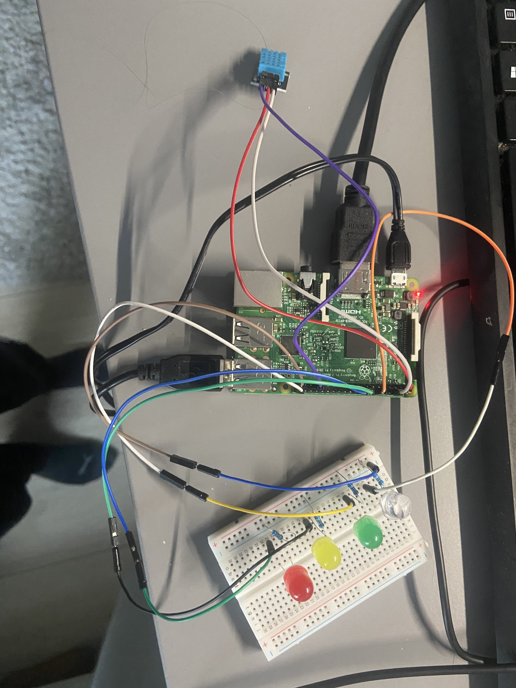
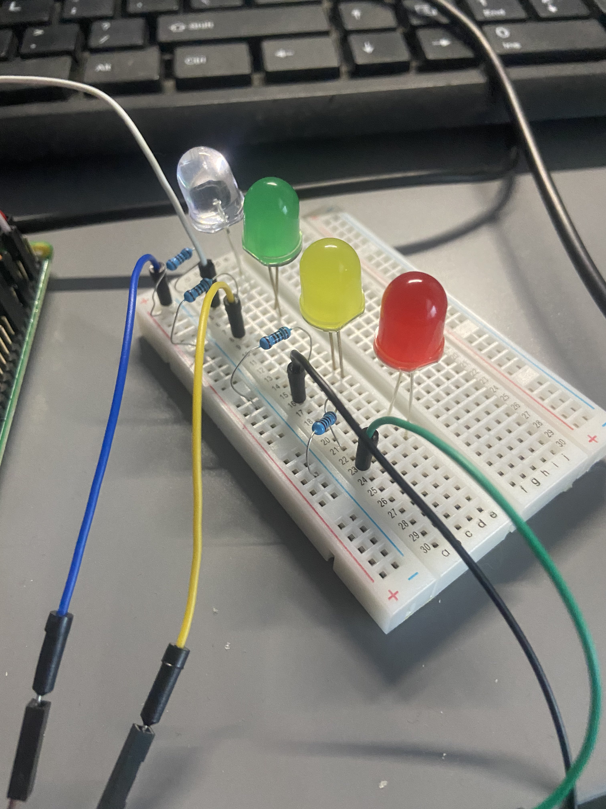
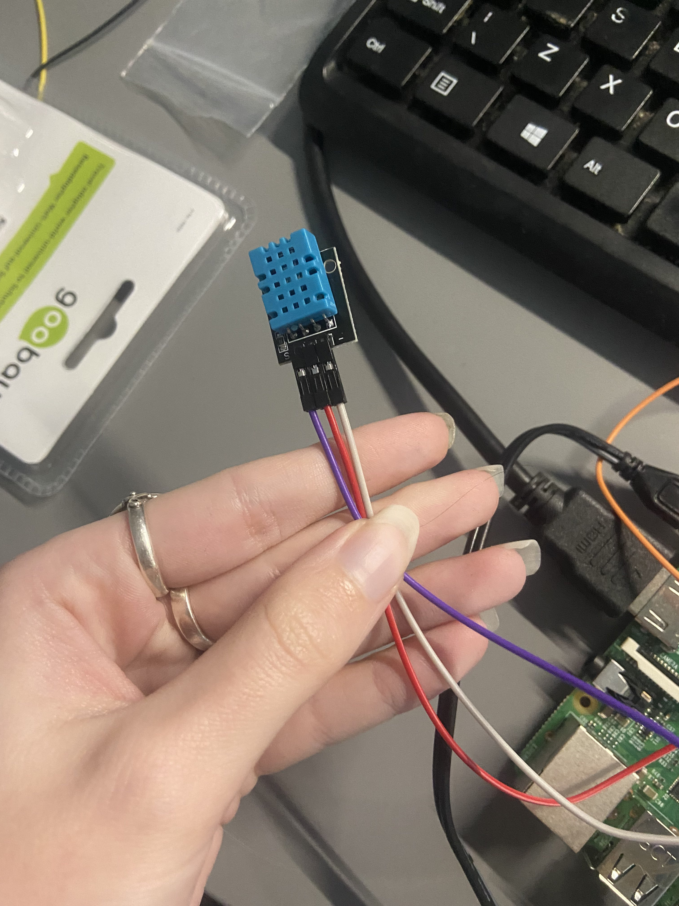

# Data science for IOT 
Data Science for Internet of Things - Keuzevak HR periode 2, 2022

### The idea 
Originally, I wanted to make a diary bot that takes pictures and logs your emotions while you are telling the bot a story about your day to get more insight on your mental health because I think that is very important especially during covid and the things you head about the mental state of young adults nowadays. After doing some research online, I sadly came to the conclusion that this was too complicated with my level of experience and the time we were given for this project. Although I have some IoT experience, I am relatively new to coding and had no experience with the language and device provided to us, the camera module and the Google cloud needd for this project seemed a it too complicated for what was asked from us.

For this new idea, I was inspired by my 11-year-old sister, or actually by her assignment about the air / masks at school during covid. A healthy environment is a must while you are at work or school (or just at home). Not just because of covid, but it's important at any time. The room temperature and humidity play a part in that. A high humidity percentage stimulates the growth of micro-organisms. Tihs can lead to various problems that all negatively affect your overall workflow. Some issues will occur overtime, but concenstration issues can occur right away, and I need to stay concentrated myself to be able to do my work. 

### Goal of the project
I have set some personal goals for this project, and ofcourse the end-goal of this project.

#### Project
I want to show the status of the humidity and temperature through a simple device so that simple things, such as opening a window, are done before the issues listed earlier occur, but also to spot long-term trends. The information should be tracked and saved. It should then be used on an external website, which provides the last status, a daily, weekly and a monthly report of the avarage temperature and humidity. That way you can spot trends (let's say the humidity is much higer on a certain day, you can increase the ventilation beforehand) but also assure people that the humidity and temperature is healthy to work in. Moreover, the reports could also show a relation between the temperature and the humidity, and show what temperatures are the best to work in to make sure the humidity is good. 

The collected data is the humidity level, the temperature in Celcius (through the DHT11), temperature in Fahrenheid (based on the temperature in C from the DHT11) and the status the status (1 = good 2 = indication of it getting worse 3 = bad)

The data is then sent to ThingSpeak, which saves it so it can be used by the web application through the API for the reports and to show the correlation between the room temperature and humidity.

#### Personal
Prior experiences 
- When I just started my studies (CMGT) I made an IoT device, so I have some knowledge of IoT which I've used in this project. I made a 'vergeet-me-niet' medicine reminder bot for eldery. It was coded in a simplified coding application called 'MakeCode' which uses Javascript as programming language. 
- In the second period of this year, we had to build our own reservation system. I learnt how to make post and get requests, which I could use in this project as well to update the channels and to retrieve information from TeamSpeak.  

I hope to expand my knowledge and get comfortable with the basics of Python so I can start bigger projects like a Discord bot that can help me pick and send predefined replies at my work, as well as counting the amount of tickets I do per day and hour. I work at a Minecraft server's customer service and tickets are done through Discord. Ofcourse a healthy work environment is also important for myself, so I hope to benefit from this device as well. 

## The Project

### The set-up & pipeline
The data pipeline for this project:

Hardware used for the project (requirements):
- Raspberry Pi 3 or newer
- DHT11 or DHT22 sensor
- 4 LEDs 
- Breadboard
- Male-female or female-female male-male jumper wires

A (free) ThingSpeak channel is also needed with the following fields:
- Status (1 = Great, 2 = Worse 3 = Bad)
- Temperature (in C, measured by the DHT11)
- Temperature (in F, calculation based on the temperature in C)
- Humidity (In %, measured by the DHT11)

### The proces 
The prototype in its current form is not impressive. I spent most time figuring out the code so it doesn't have a proper case or anything like that. It is just a bunch of wires connected to some LEDs and the GPIO pins of the Pi. 

I started with a simple project, trying to light a LED using the GPIO pins and a script. I used an article which also showed me how to set it up which was really helpful. The code for that is in the `test_LED.py` file.
There is one jumpwire going from the GPIO pin to the breadboard, then there is a resistor in the circuit to prevent the LED from exploding/breaking. There is one more wire which goes from the ground to the top left of the board, this one is being used by all LEDs. This is possible because all the outer lines are connected vertically, while all the inner points are connected horizentally. 

 It went alright, I felt confident going onto the next step after this, working with the sensor.   

I had done research about the sensor and how to set it up, and it went smoothly. At first I decided to test the sensor without the LEDs and ThingSpeak involved. 
The middle wire goes to the 3.3V (always on power), the right one to the ground and the left one goes to the GPIO pin.

``dhtDevice = adafruit_dht.DHT11(board.D13)``
The code itself worked fine, but I stumbled accross an error that had to do with this line. After stopping the script and re-running it, it would tell me 'unable to set line 13 to input' until I completely rebooted the Pi. I searched on Google and saw that it was a known issue. People recommended other libraries so I digged into that and looked for other examples. When I found that, I changed the code and the issue was gone. The code of this is in `test_measure.py`. 

Then onto the next step, enabling the LED based on the humidity level. The else if statement was a bit different than what I was used to, so I had to google how to write that down. After that it went solid. I did come across another issue of the LEDs not disabling when the script was stopped. I did have a `GPIO.cleanup() ` in there, but ofcourse, if the script is stopped, it can never reach it. I Googled online and saw the 'try, except' which I used in my script to disable the LEDs upon keyboard interruption (CTRL+C). I implemented this in my `main.py` on line 50. 

Then the hardest part, sending the data to ThingSpeak. At first, I was using a script that was not competible with the Python that we are on right now due to the outdated libraries, so I had to find something else.  After looking online I came accross the Requests Python docs and the mathlab ones about writing data to a channel.  I found an example and took inspiration from it, but changed the updates to single updates to make things easier for myself. It finally worked, and it was such a relieve.  
 <a href="https://thingspeak.com/channels/1642875">ThingSpeak Channel</a>  
Putting everything together went pretty smoothly to be honest, I was really happy when everything worked. 
 Here are the charts shown of the data. 
### <a href="https://youtu.be/Vzg6vLiX4uQ">YOUTUBE: DEMO WORKING PROTOTYPE </a>  

The last part of the pipeline is to send the ThingSpeak data to a website. I did this with Javascript and HTML. It is not very complicated right now, it simply shows a daily report with the averages per hour. Async functions are still a bit complicated for me so I was not able to really figure out how to change the parameters without creating a lot of files of the same script but with a different url. I hope to create options in the future where you can select different timeframes etc. A daily report won't be enough to get insights but once there are enough datapoints we can create monthly reports and charts to get a better picture, as well as seeing the correlation of the temperature and humidity. I also hope to get rid of the 'null' values someday, I was not able to figure that out unfortunately, but that's also due to the fact that the channel is new and that the device didn't run at night. The script I used for the API call is in `script.js`
  <a href="https://isissss.github.io/Data-SCI-02/">Github pages - Website</a>  
 
### What's next?
This project was a lot harder than I expected but I am pretty proud of the result. It may not be impressive yet but I already have ideas about expanding this. I would like to add
- Notifications when it's  turning red. With messages such as 'these circumstances aren't great to work in. If you haven't opened a window yet, you may want to do that and go for a walk to get fresh air.'
- More options in the panel, such as selecting timeframes
- Linking this to external devices so that the temperature can be regulated based on the data measured by this device, as well as the ventilation

### Sources
During this project I've used several website and sources to create my code. I have gathered information from:
- <a href="https://docs.python-requests.org/en/master/user/quickstart/">Requests Python docs</a>
- <a href="https://www.raspberrypi-spy.co.uk/2017/09/dht11-temperature-and-humidity-sensor-raspberry-pi/">DHT11 Temperature and Humidity Sensor and the Raspberry Pi</a>
- <a href="https://nl.mathworks.com/help/thingspeak/writedata.html;jsessionid=57ca7fb5ff69ea6dab8a95847248">Mathworks ThingSpeak writedata documentation</a>
- <a href="https://nl.mathworks.com/help/thingspeak/readdata.html;jsessionid=57ca8759e47f248719045080ec55">Mathworks ThingSpeak readdata documentation</a> 
- <a href="https://roboticsbackend.com/raspberry-pi-control-led-python-3/">Control an LED with Raspberry Pi 4 and Python 3</a> 
